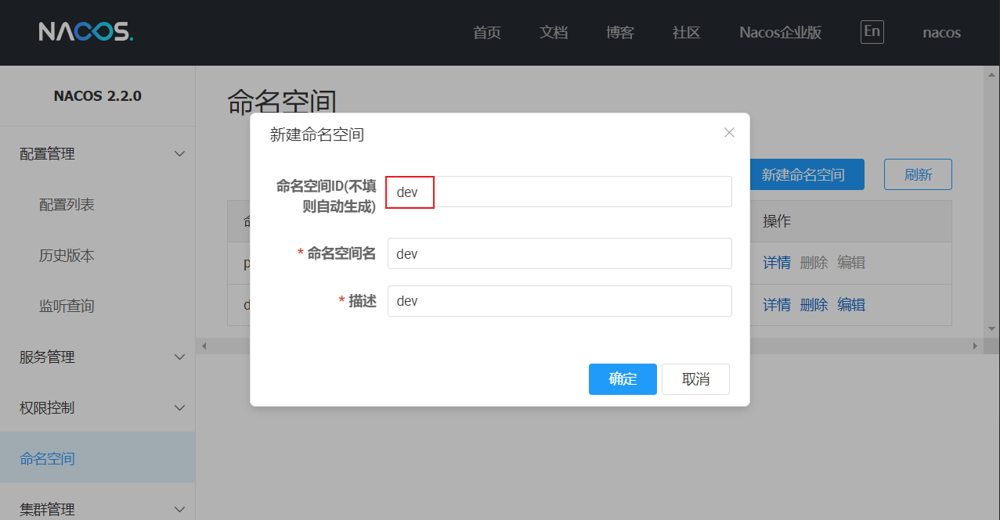
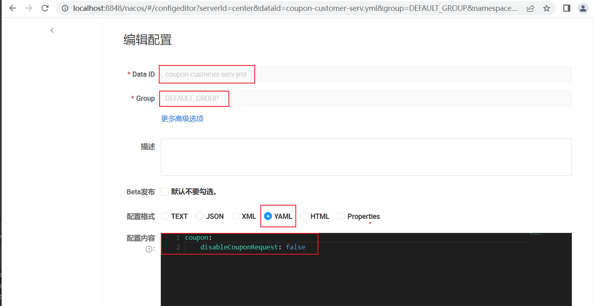

# Nacos 配置中心

[TOC]

## 配置管理方式

Sping Boot 配置文件：
* bootstap.yml
* application.yml

传统的配置管理方式：
* 硬编码：没有将业务逻辑和配置管理的职责分离
* 配置文件：需要重新编译打包
* 环境变量、启动参数：需要重启应用，无法做到动态更新
* 数据库、Redis：DB 性能、版本控制、安全性

Nacos 配置中心特性：
* 高可用性：集群
* 环境隔离：Namespace
* 多格式支持
* 访问控制：权限管理
* 职责分离
* 版本控制和审计功能
* 动态变更推送

配置动态更新使用场景：
* 业务开关：非关键业务人工降级、上下游业务同步上线（等等其他业务上线时打开开关）
* 业务规则更新（频繁变更的配置规则）
* 灰度发布验证：Nacos Beta 发布功能（将配置推送到指定的 IP）

## Nacos 配置中心

Nacos 单机模式 `standalone-start.cmd`：
```
start startup.cmd -m standalone
```

用户名密码：nacos/nacos

### 依赖

依赖：
* Nacos-config： 配置中心
* Spring-cloud-starter-bootstrap：bootstrap 配置

```xml
<dependency>
    <groupId>com.alibaba.cloud</groupId>
    <artifactId>spring-cloud-starter-alibaba-nacos-config</artifactId>
</dependency>
<dependency>
    <groupId>org.springframework.cloud</groupId>
    <artifactId>spring-cloud-starter-bootstrap</artifactId>
</dependency>
```

配置文件：`/resources/bootstrap.yml`
```yaml
spring:
  application:
    name: coupon-customer-serv
  cloud:
    nacos:
      config:
        server-addr: localhost:8848 # Nacos 配置中心地址
        file-extension: yml
        # prefix: # 文件名前缀，默认是spring.application.name
        namespace: dev # 命名空间ID，默认是 则默认命令空间为 PUBLIC
        group: DEFAULT_GROUP # 默认值为 DEFAULT_GROUP
        timeout: 5000 # 从Nacos读取配置项的超时时间
        config-long-poll-timeout: 10000 # 长轮询超时时间
        config-retry-time: 2000 # 轮询的重试时间
        max-retry: 3 # 长轮询最大重试次数
        refresh-enabled: true # 开启监听和自动刷新
        # Nacos的扩展配置项，数字越大优先级越高
        extension-configs:
          - dataId: redis-config.yml
            group: EXT_GROUP
            refresh: true # 动态刷新
          - dataId: rabbitmq-config.yml
            group: EXT_GROUP
            refresh: true
```

Nacos 配置文件名（dataId）完整格式：`${prefix}-${spring.profiles.active}.${file-extension}`
* prefix：默认是 spring.application.name
* profile：没有配置时，则为空并且去掉前面的横杠

配置类：
```java
@Data
@Component
@RefreshScope // 动态推送配置需要该注解（加上该注解后，当 Bean 被刷新时，依赖它的 Bean 会拿到新的实例） 
@ConfigurationProperties("coupon")
public class CouponProperties {
    /**
     * 暂停领取优惠卷
     * */
    private Boolean disableCouponRequest;
}
```

创建配置


> 配置中的 `namespace` 用的是命名空间ID，而不是命名空间名称


